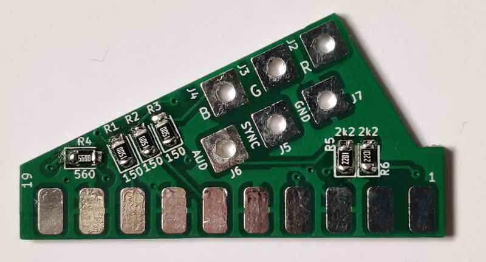
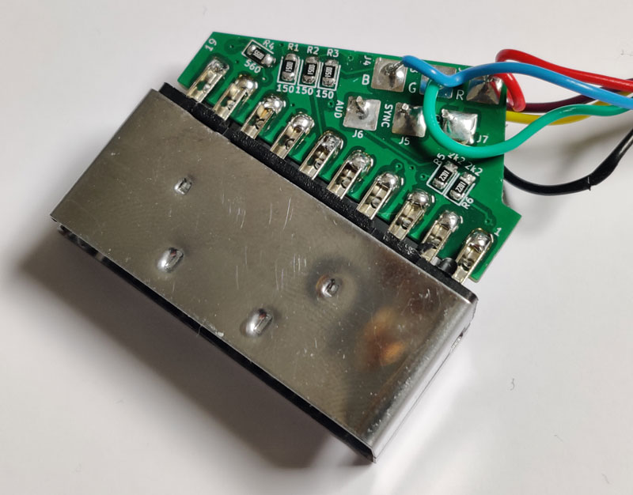

# P2000T SCART adapter plate

Small four-layer PCB to interface the six wires of the RGBS port with a 
SCART connector.

## Purpose

To interface a P2000T with a SCART-compatible monitor or television, a couple
of resistors need to be placed. This PCB accommodates the resistors in a small
0805 form factor and allows for a sturdy connection with the SCART connector.

## PCBs

## Cable assembly

1. Solder the 0805 resistors onto the PCB.
2. Solder the wires onto the PCB and in turn solder the PCB to the SCART connector.
3. Place the SCART connector into its enclosure and close it.
4. Connect the wires to their corresponding terminals in the DIN6 connector.

The signals on the RBGS, as seen by looking into the female socket on the back
side of the P2000T, is provided below. **Note that the colors in the image below
do not necessarily correspond to the wire colors as shown above.**

## Bill of materials

* 2 x 2.2kΩ 0805 resistors
* 3 x 150Ω 0805 resistors
* 1 x 560Ω 0805 resistor
* 1 x SCART connector
* 1 x DIN6 male connector
* 6-wire cable